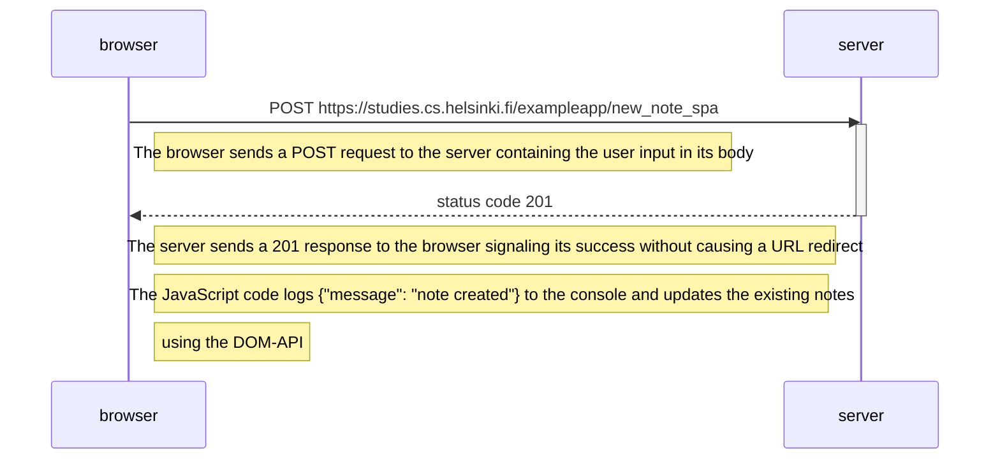

```mermaid
sequenceDiagram
#exercice 0.6
    participant browser
    participant server

    browser->>server: POST https://studies.cs.helsinki.fi/exampleapp/new_note_spa
    activate server

    Note right of browser: The browser sends a POST request to the server containing the user input in its body

    server-->>browser: status code 201
    deactivate server

    Note right of browser: The server sends a 201 response to the browser signaling its success without causing a URL redirect

    Note right of browser: The JavaScript code logs {"message": "note created"} to the console and updates the existing notes 
    
    Note right of browser: using the DOM-API  

```